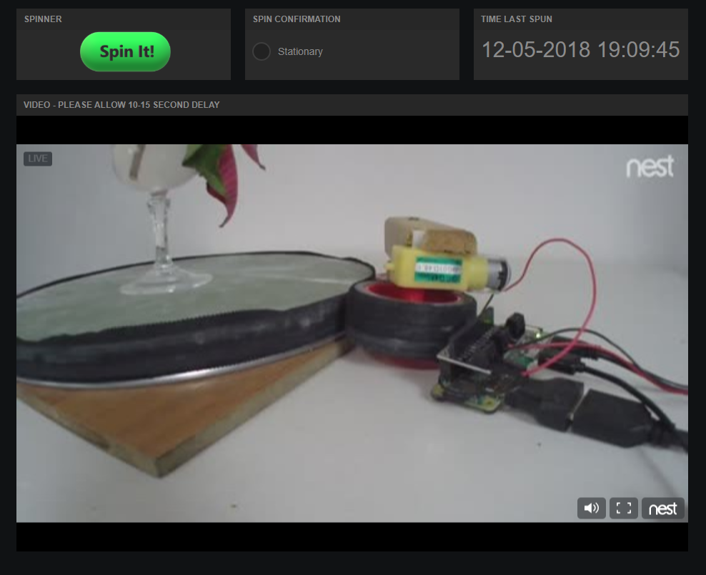

# dweetPro™ Python Code Example
Example python code for using [dweetPro](https://dweetpro.io) with an RPi board.

The dweetProExample.py code is free to use as an example for connecting an RPi to the dweetPro messaging platform.
This code sets up the RPi board with a motor shield connected to it, importing the necessary libraries.

   

The python code spins a motor for 3 seconds, notes the time, then sleeps for 30 seconds. The code then sends the timestamp to dweetPro. 

   

That timestamp can be visualized in a freeboard™ dashboard.

   

Read more about the project here: http://buglabs.tumblr.com/post/176850210186/how-to-connect-your-rpi-to-dweetpro
